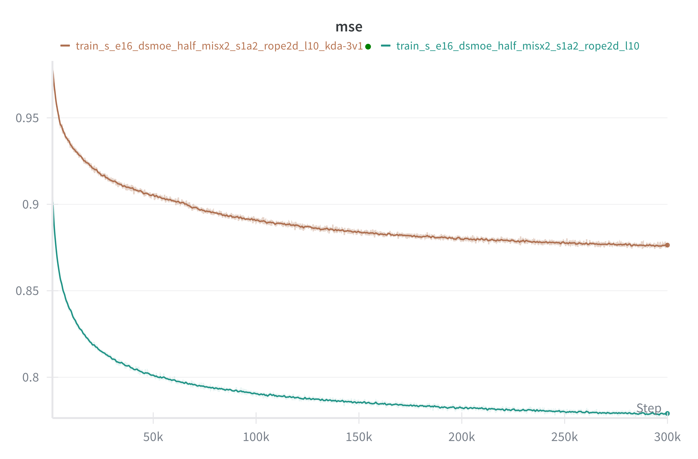

### Training of DSMoE

After configuring the environment, we can start training according to the privided scripts:

| Script                | Training Model |
|----------------------------|-------------------------|
|[`train_s_e16_dsmoe.sh`](./scripts/train_s_e16_dsmoe.sh)|DSMoE-S-E16|
|[`train_s_e48_dsmoe.sh`](./scripts/train_s_e48_dsmoe.sh)|DSMoE-S-E48|
|[`train_b_e16_dsmoe.sh`](./scripts/train_b_e16_dsmoe.sh)|DSMoE-B-E16|
|[`train_b_e48_dsmoe.sh`](./scripts/train_b_e48_dsmoe.sh)|DSMoE-B-E48|
|[`train_L_e16_dsmoe.sh`](./scripts/train_l_e16_dsmoe.sh)|DSMoE-L-E16|
|[`train_L_e48_dsmoe.sh`](./scripts/train_l_e48_dsmoe.sh)|DSMoE-L-E48|
|[`train_3b_e16_dsmoe.sh`](./scripts/train_3b_e16_dsmoe.sh)|DSMoE-3B-E16|

For `L` and `3B` size models, we refer to use FSDP training methods.  

- Training examples:

```
sh ./scripts/train_s_e16_dsmoe.sh
```

- Training with FSDP for larger models:

Please set the `master_addr` first, then start the script on master and slaver servers respectively:

```
# on Master server
sh ./scripts/train_3b_e16_dsmoe.sh 0

# on Slave server
sh ./scripts/train_3b_e16_dsmoe.sh 1
```

- Training example of using KDA:

```
sh ./scripts/train_s_e16_dsmoe_kda.sh
```



**Simply and directly replacing MHA blocks with KDA is not beneficial for the training convergence of diffusion-based DiT models.**